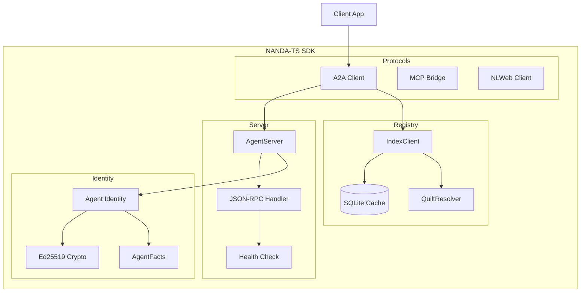
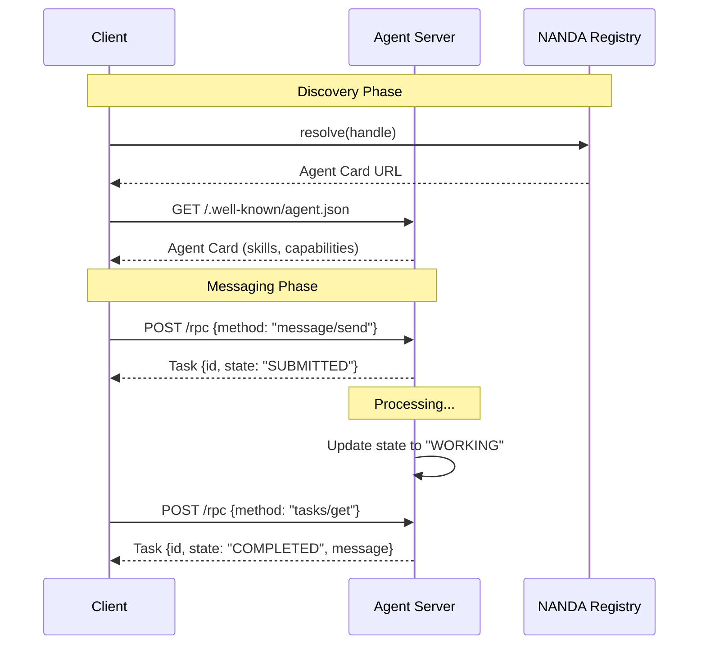
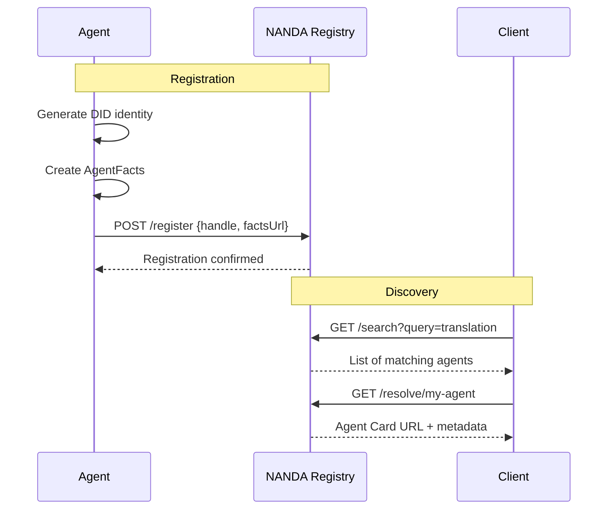
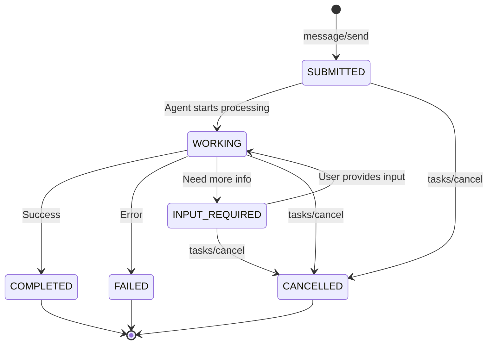

# nanda-ts

A Bun-native TypeScript SDK for the NANDA ecosystem, implementing A2A, MCP, and NLWeb protocols with registry integration and AgentFacts support.

## Architecture Overview



## Features

- **A2A Protocol v0.3.0** - Full implementation of Google's Agent-to-Agent protocol
- **MCP Bridge** - Protocol bridge for Anthropic's Model Context Protocol (stub)
- **NLWeb Client** - Microsoft's Natural Language Web interface
- **NANDA Registry** - Agent discovery and registration
- **AgentFacts** - Verifiable agent metadata
- **DID Identity** - `did:key` based agent identity
- **SQLite Cache** - Built-in caching using `bun:sqlite`
- **Zero Dependencies** - Uses only Bun-native APIs

## Installation

```bash
bun add nanda-ts
```

## Quick Start

### Creating an Agent Server

```typescript
import { AgentServer } from 'nanda-ts';

const server = new AgentServer({
  name: 'my-agent',
  description: 'A helpful AI agent',
  version: '1.0.0',
  port: 3000,
  skills: [
    {
      id: 'chat',
      name: 'Chat',
      description: 'General conversation',
      inputModes: ['text'],
      outputModes: ['text'],
    },
  ],
});

server.onMessage(async (params, ctx) => {
  const task = ctx.createTask(
    {
      role: 'agent',
      parts: [{ type: 'text', text: 'Hello! How can I help?' }],
    },
    params.contextId
  );
  ctx.updateTaskState(task.id, 'COMPLETED');
  return { ...task, state: 'COMPLETED' };
});

await server.start();
```

### Connecting to an Agent

```typescript
import { A2AClient } from 'nanda-ts';

const client = new A2AClient({
  agentUrl: 'http://localhost:3000',
});

// Discover agent capabilities
const card = await client.discover();
console.log(`Agent: ${card.name}`);
console.log(`Skills: ${card.skills.map(s => s.name).join(', ')}`);

// Send a message
const task = await client.sendMessage({
  message: {
    role: 'user',
    parts: [{ type: 'text', text: 'Hello!' }],
  },
});

console.log(`Response: ${task.message?.parts[0].text}`);
```

### Using the Registry

```typescript
import { createIndexClient } from 'nanda-ts';

const registry = createIndexClient();

// Search for agents
const agents = await registry.search({ query: 'translation' });

// Resolve an agent by handle
const agent = await registry.resolve('my-agent');

// Register your agent
await registry.register({
  handle: 'my-agent',
  factsUrl: 'https://example.com/agent-facts.json',
});
```

## CLI

```bash
# Create a new agent project
bunx nanda-ts init my-agent

# Run in development mode
bunx nanda-ts dev

# Register with NANDA
bunx nanda-ts register my-agent https://example.com/facts.json
```

## Protocol Flows

### A2A Message Flow



### Registry Integration



## API Reference

### AgentServer

The main server class for hosting A2A-compliant agents.

```typescript
const server = new AgentServer({
  name: string;           // Agent name
  description: string;    // Agent description
  version?: string;       // Semantic version (default: '1.0.0')
  port?: number;          // HTTP port (default: 3000)
  skills?: Skill[];       // Agent capabilities
  provider?: Provider;    // Organization info
});

// Register message handler
server.onMessage(async (params, ctx) => Task);

// Lifecycle
await server.start();
await server.stop();
server.isRunning();
```

### A2AClient

Client for communicating with A2A agents.

```typescript
const client = new A2AClient({
  agentUrl: string;       // Agent base URL
  timeout?: number;       // Request timeout in ms
  headers?: Record<string, string>;
});

// Discovery
const card = await client.discover();

// Messaging
const task = await client.sendMessage(params);
const streamedTask = await client.sendMessageStream(params);

// Task management
const task = await client.get(taskId);
const { tasks } = await client.listTasks();
const cancelled = await client.cancelTask({ taskId });
```

### IndexClient

NANDA registry client for agent discovery.

```typescript
const registry = createIndexClient({
  baseUrl?: string;       // Registry URL
  apiKey?: string;        // API key
  cacheEnabled?: boolean; // Enable caching
});

const agent = await registry.resolve(handle);
const results = await registry.search({ query, capabilities, protocols });
const response = await registry.register({ handle, factsUrl });
```

### NLWebClient

Client for NLWeb natural language queries.

```typescript
const nlweb = new NLWebClient({ baseUrl: 'https://example.com' });

// Discover capabilities
const manifest = await nlweb.discover();

// Ask a question
const response = await nlweb.ask('What products do you have?');

// Stream results
for await (const item of nlweb.askStream('Show me all items')) {
  console.log(item);
}
```

## Endpoints

When you start an AgentServer, it exposes:

| Endpoint | Description |
|----------|-------------|
| `/.well-known/agent.json` | Agent Card (discovery) |
| `/rpc` | JSON-RPC 2.0 endpoint |
| `/rpc/stream` | Streaming JSON-RPC |
| `/health` | Health check |
| `/healthz` | Liveness probe |
| `/readyz` | Readiness probe |

## JSON-RPC Methods

| Method | Description |
|--------|-------------|
| `message/send` | Send a message to the agent |
| `tasks/get` | Get task by ID |
| `tasks/list` | List all tasks |
| `tasks/cancel` | Cancel a task |

## Task States

```typescript
type TaskState =
  | 'SUBMITTED'      // Task received
  | 'WORKING'        // Processing
  | 'INPUT_REQUIRED' // Waiting for user input
  | 'COMPLETED'      // Successfully completed
  | 'FAILED'         // Failed with error
  | 'CANCELLED';     // Cancelled by user
```

### Task State Machine



## Development

```bash
# Clone the repository
git clone https://github.com/nanda-ai/nanda-ts.git
cd nanda-ts

# Install dependencies
bun install

# Run tests
bun test

# Type check
bun run typecheck

# Run examples
bun run examples/basic-server.ts
```

## Project Structure

```
nanda-ts/
├── src/
│   ├── protocols/
│   │   ├── a2a/          # A2A protocol client & utilities
│   │   ├── mcp/          # MCP protocol bridge
│   │   └── nlweb/        # NLWeb client
│   ├── server/           # Agent server implementation
│   ├── registry/         # NANDA registry client
│   ├── agent/            # Agent identity & facts
│   ├── crypto/           # Keys & signatures
│   └── types/            # TypeScript types
├── cli/                  # CLI tool
├── examples/             # Usage examples
└── tests/               # Test suite
```

## License

MIT
